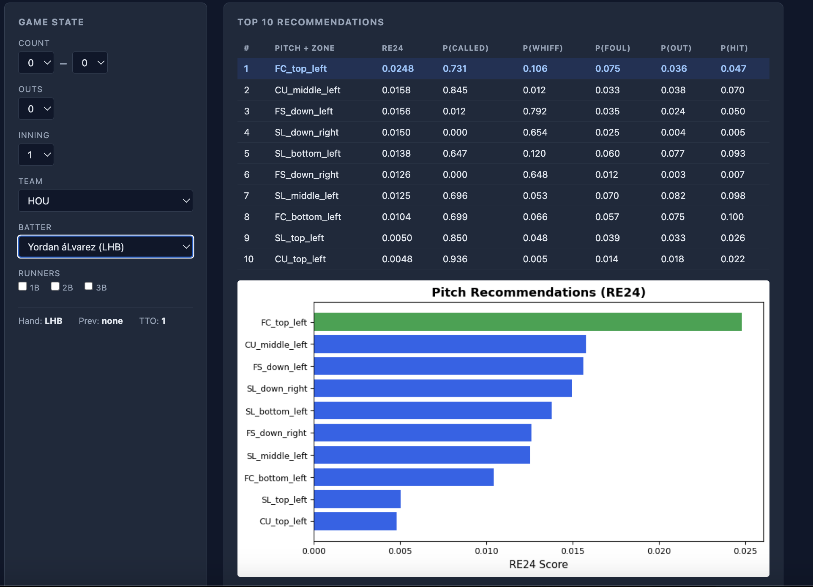
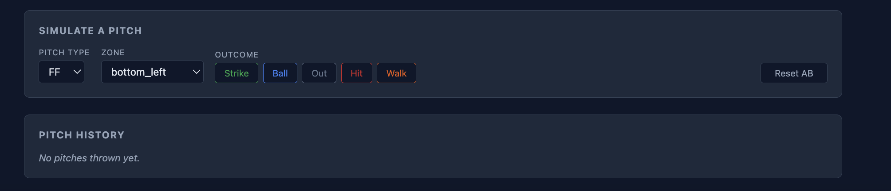
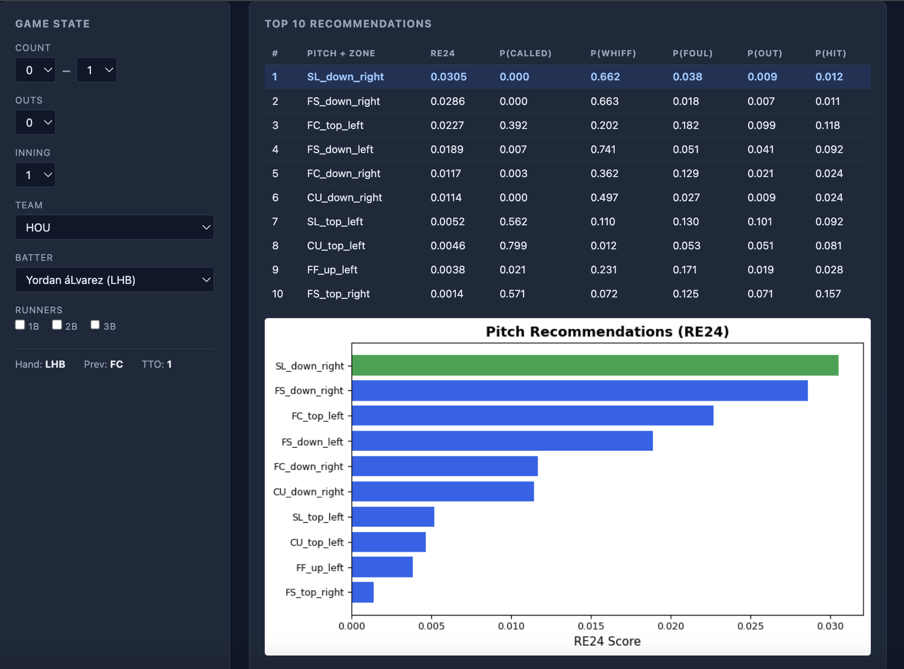
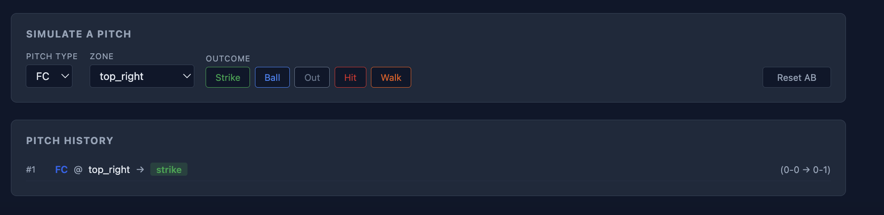
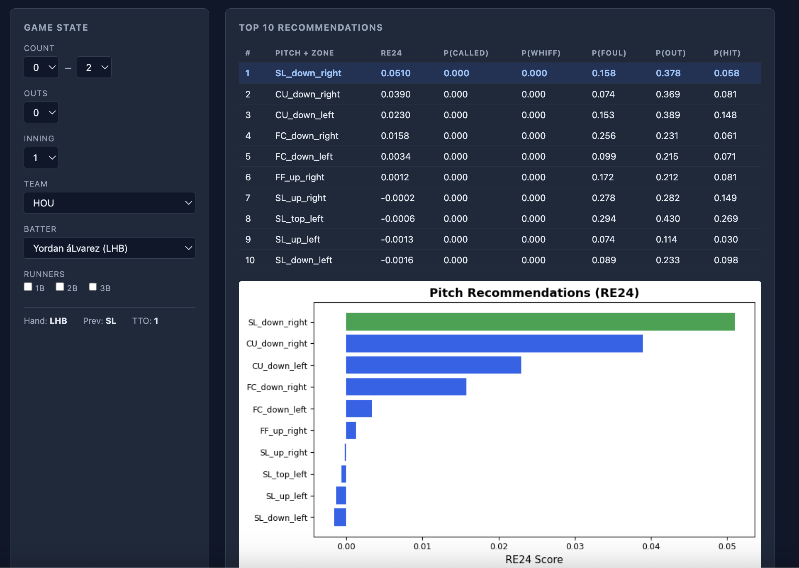
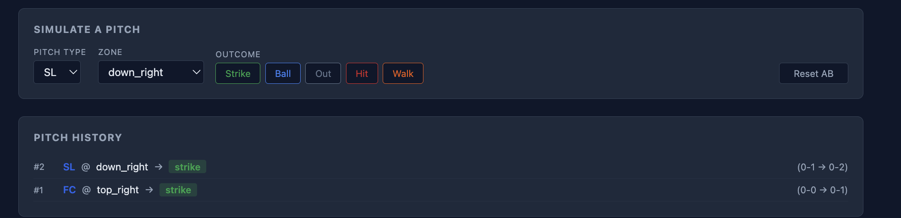
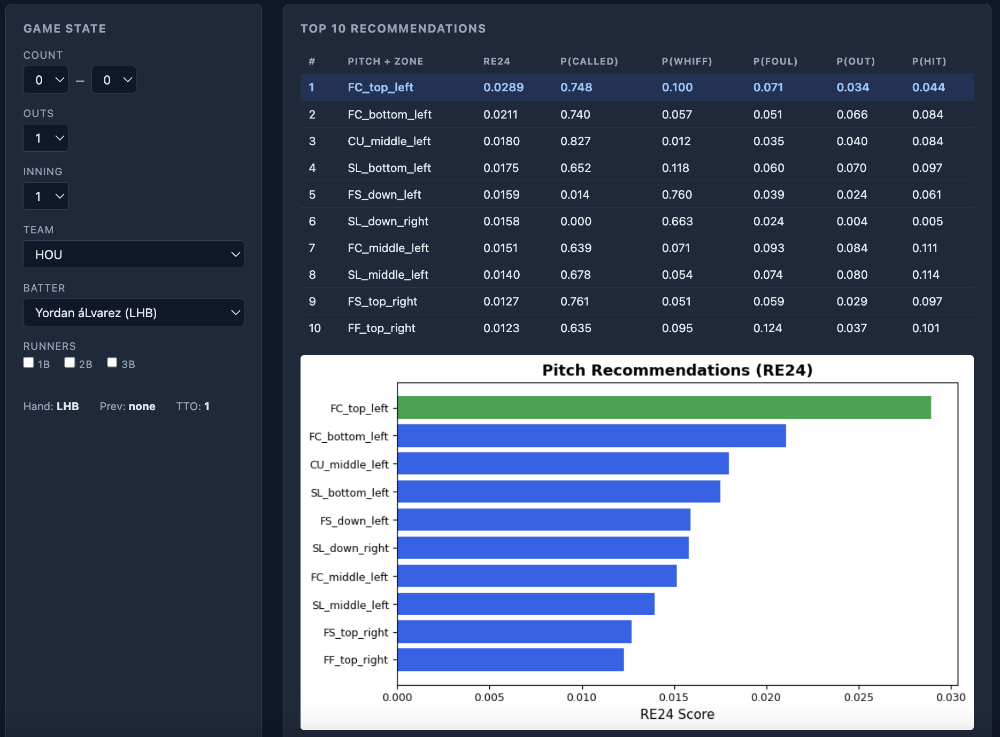
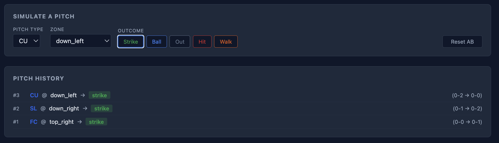

# Walkthrough: Eovaldi vs Yordan Alvarez

A step-by-step demo of the Pitch Sequence Optimizer simulating a full at-bat between **Nathan Eovaldi** and **Yordan Alvarez (LHB)**.

---

## 1. Setting Up the Matchup

Select **Yordan Alvarez** as the batter (filtered by team HOU) and set the game situation — 0-0 count, 0 outs, bases empty, 1st inning at home in Houston.

The app immediately generates the top 10 pitch+zone recommendations ranked by RE24 score. Against Alvarez at 0-0, the model favors an **FC (cutter) to top_left** — a pitch on the upper corner away from the left-handed hitter that has a high called strike probability (0.731) while keeping hit probability low (0.047).

The pitch simulator is ready at the bottom. No pitches have been thrown yet.

---

## 2. Pitch 1 — Cutter, Called Strike (0-1)

Following the model's top recommendation, Eovaldi throws an **FC to top_right** — a cutter on the upper inside corner to the left-handed Alvarez. The result is a called **strike**.

After clicking Strike, the app auto-updates:
- The **count** moves from 0-0 to **0-1**
- The **previous pitch** updates to **FC** (visible in the game state panel)
- The **recommendations table** refreshes with new rankings optimized for the 0-1 count
- The **pitch history** logs the pitch: `#1 FC @ top_right → strike (0-0 → 0-1)`

With the count now in the pitcher's favor, the model shifts its strategy — an **SL (slider) to down_right** jumps to the #1 recommendation (RE24: 0.0305). The model values changing the batter's eye level after starting with a pitch up in the zone.

---

## 3. Pitch 2 — Slider, Swinging Strike (0-2)

With the count in his favor, Eovaldi changes eye levels and throws an **SL to down_right** — a slider buried low and away. Alvarez swings and misses — **strike**.

Again, everything auto-updates:
- Count moves to **0-2**
- Previous pitch updates to **SL**
- The recommendations shift dramatically — now dominated by **put-away pitches off the zone**

At 0-2, notice how the model's strategy changes completely. The top recommendation is **SL_down_right** again (RE24: 0.0510) — bury another slider and try to get the strikeout. The P(Whiff) and P(Out) columns are now the focus since the pitcher can afford to waste a pitch. Several recommendations even show **negative RE24 scores** for pitches in the zone — the model is saying "don't throw anything hittable."

---

## 4. Pitch 3 — Curveball, Strikeout

Time to put Alvarez away. Eovaldi goes with a **CU to down_left** — a curveball dropping below the zone on the opposite side of the slider. Alvarez chases — **strike three**.

The strikeout triggers a full state reset:
- Count resets to **0-0**
- **Outs** increments from 0 to **1**
- Previous pitch resets to **none** (fresh at-bat for the next batter)
- Recommendations regenerate for a new plate appearance with 1 out

The pitch history preserves the full 3-pitch sequence, showing the complete progression from 0-0 through the strikeout.

---

## Key Takeaways

- **Recommendations update after every pitch** — the model recalculates based on the new count, what was just thrown (sequencing), and cumulative pitch count
- **Count leverage matters** — getting ahead (0-1, 0-2) opens up more aggressive options; the RE24 scores increase as the pitcher gains an advantage
- **Sequencing is built in** — after a cutter up, the model values breaking balls down because of the eye-level change
- **Terminal outcomes auto-advance the game state** — strikeouts add an out and reset the count, walks put a runner on, hits advance baserunners
- **Pitch history tracks the full at-bat** — every pitch is logged with its count transition, so you can review the sequence after it ends
